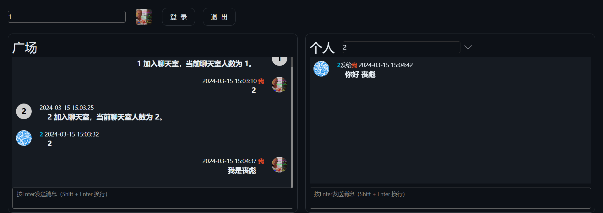

# go 聊天室 聊天广场 群聊 单聊
    无数据库，临时会话

# 开发

## golang 服务
    set ENV_VAR=dev
    set GOOS=windows
    go mod tidy
    go run .
## 前端
    pnpm i
    pnpm dev

# 打包
    set ENV_VAR=build
    set GOOS=linux
    go build -o publicchat .

